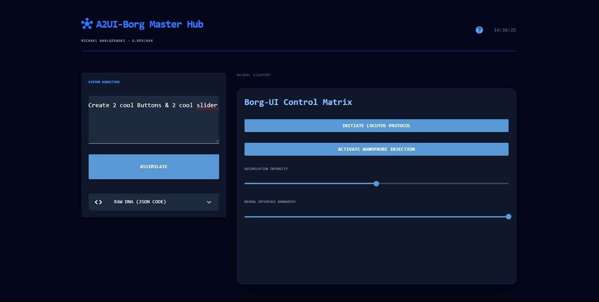

# A2UI-Borg Master Hub 🧠🤖

**Architect:** Michael Barlozewski ([g.dev/avx](https://g.dev/avx))

A2UI-Borg is an autonomous neural interface system designed for the instant assimilation of natural language into functional UI components. Described as the "favorite pet" of the Borg Queen, it combines high-end LLM logic with a sleek, minimalist aesthetic.

### 📸 Interface Preview

*Neural assimilation in progress - generating high-fidelity UI components.*

### 🚀 Core Features
* **Neural Assimilation:** Uses **Mistral Large 3 (675B)** to convert text commands into structured UI-DNA.
* **Collective Knowledge:** Dynamically adjustable behavior via `help.json`.
* **Evolutionary Snapshots:** Automatic local archiving of every successful UI generation.
* **DNA Export:** Instant access to raw JSON code for external use.
* **Borg Aesthetics:** A high-performance dark-themed viewport built with NiceGUI.

### 🛠️ Installation
1.  **Clone the Repository:**
    ```bash
    git clone [https://github.com/yourusername/A2UI-Borg.git](https://github.com/yourusername/A2UI-Borg.git)
    cd A2UI-Borg
    ```
2.  **Install Dependencies:**
    ```bash
    pip install -r requirements.txt
    ```
3.  **Environment Setup:**
    Create a `.env` file in the root directory and add your NVIDIA API key:
    ```text
    NV_KEY=your_nvapi_key_here
    ```
4.  **Launch the Collective:**
    ```bash
    python core.py
    ```

### 📄 License

This project is licensed under the MIT License - see the LICENSE file for details.
